# HireStream-HP · User & Testing Guide

**Portal:** https://hirestream-hp.agentryx.dev
**For:** HPSEDC UAT team
**Purpose:** how the portal works after the UAT-03 changes, and how to test each part.

The workflow — especially for candidates — has changed a lot. Please read the **Candidate** section first.

---

## 1. Access & roles

| Role | How to log in |
|------|----------------|
| **Candidate (Job Seeker)** | Register yourself on the portal (any email + a password with one capital and one special character, e.g. `Test@1234`). Anyone can register a candidate. |
| **HPSEDC Agency** (super agency) | Use the demo account `hpsedc_agency` (quick-login on the sign-in page). Manages all jobs, candidates and placements. |
| **Admin** | Use the demo account `demo_admin` (quick-login). Oversight, callbacks, support queue, grievances. |

> The portal is bilingual — use the **हिं / A** toggle in the top bar to switch **English ⇄ Hindi**. Core flows are in Hindi (first draft); the newest screens are being translated.

---

## 2. Candidate workflow (new)

### 2.1 Three ways to register

On first login a candidate is offered **three registration modes** — because our applicants range from low-literacy blue-collar workers to degree-holding professionals.

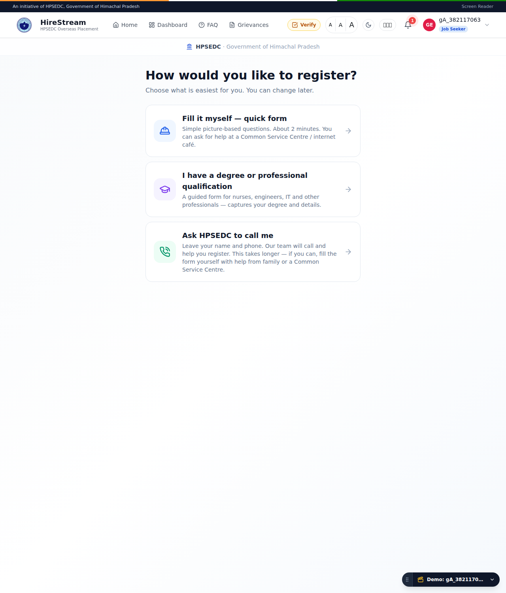

**A. Standard — "Fill it myself (quick form)"** — for **blue-collar** workers (mason, driver, cook, welder…).
A simple, **picture-based, one-question-per-screen** form (~2 minutes). Pick your trade, answer easy questions, add ID details. Designed so a worker — or a family member / Common Service Centre helping them — can complete it. Voice input (🎤) is available on text fields.

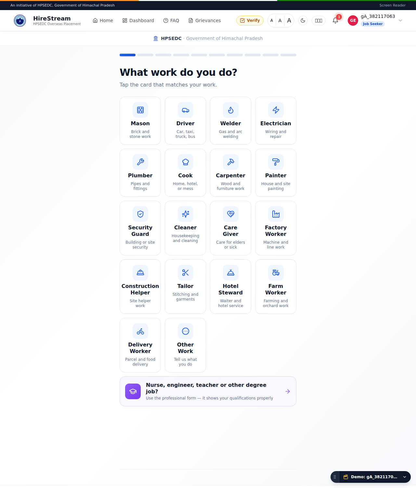

**B. Professional — "I have a degree or professional qualification"** — for **higher-education** applicants (nurses, engineers, teachers, IT).
A guided form that captures **education → degree → field → institution**, certifications, IELTS, skills and passport in detail.

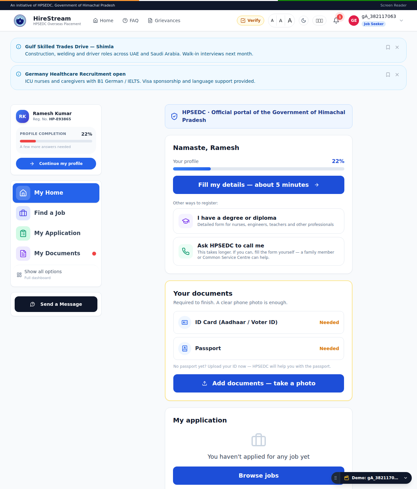

**C. Assisted — "Ask HPSEDC to call me"** — the **minimum-information** path.
The applicant leaves only **name + phone**; HPSEDC's team **calls them back** and completes the registration for them. Best for someone who can't fill a form at all.
> This mode is **configurable** — HPSEDC can turn the callback option **on or off** from the backend. When off, only Standard and Professional are shown.

### 2.2 The dashboard — Minimal ⇄ Advanced

Every applicant uses the **same dashboard layout**. Blue-collar applicants get a **Minimal** view (a few big buttons: My Home, Find a Job, My Application, My Documents); professionals get the **Advanced** view (full menu + stats + journey). A **toggle** in the left panel switches between them ("Show all options" / "Simple view").

| Minimal (blue-collar default) | Advanced (professional default) |
|---|---|
|  | 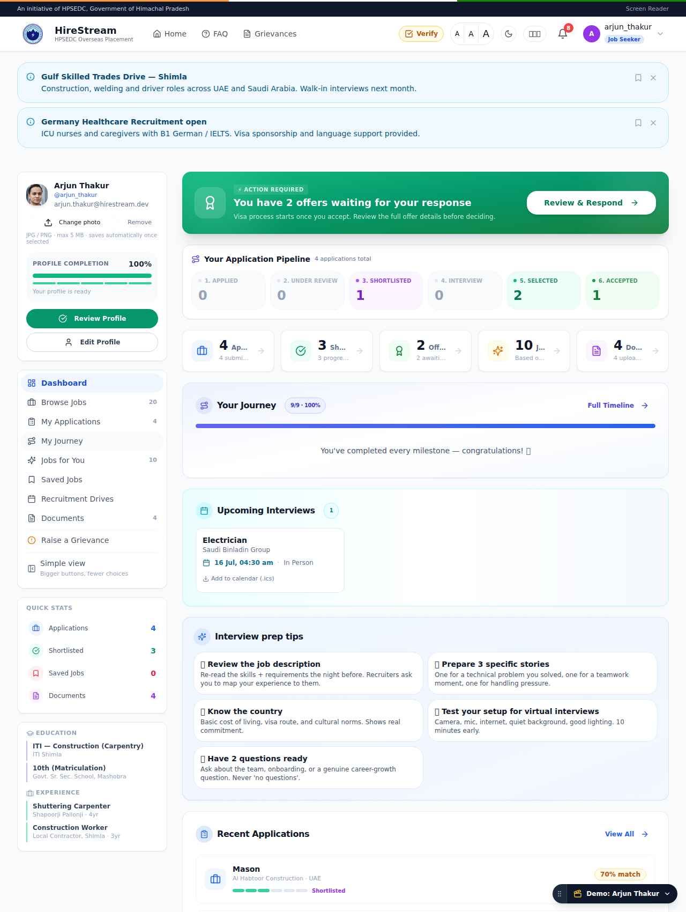 |

### 2.3 Documents are required

A profile is **not "ready" until the applicant uploads an ID (Aadhaar / Voter ID) and a passport** — mandatory for overseas placement. Documents can be a **photo or a PDF**.

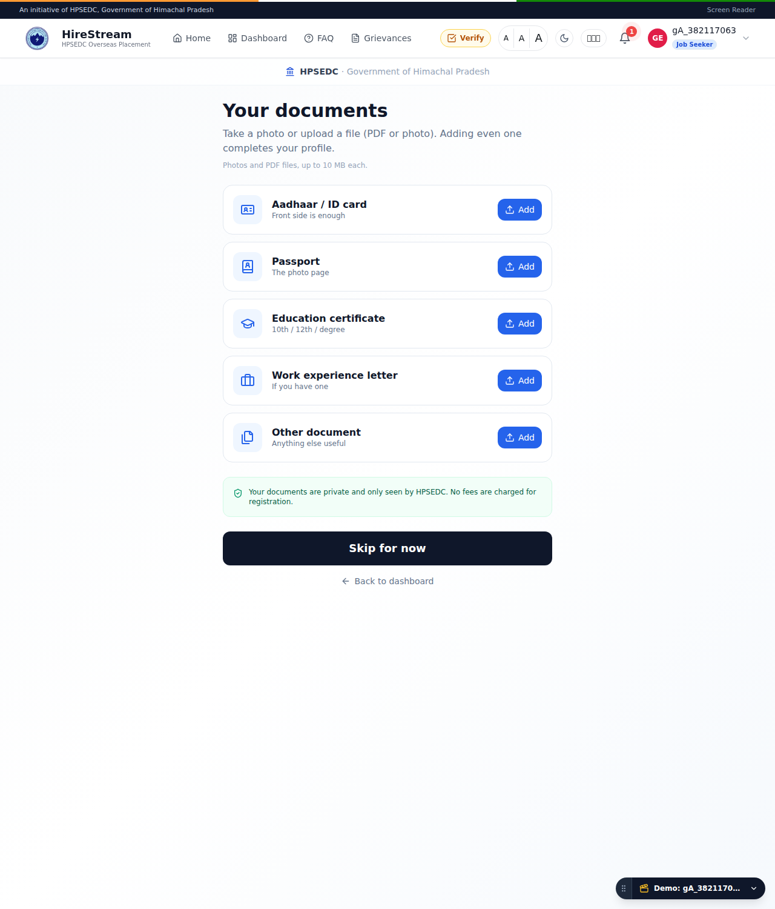

Once both are uploaded, the dashboard shows **"Your profile is ready"** with the applicant's **HPSEDC registration number**.

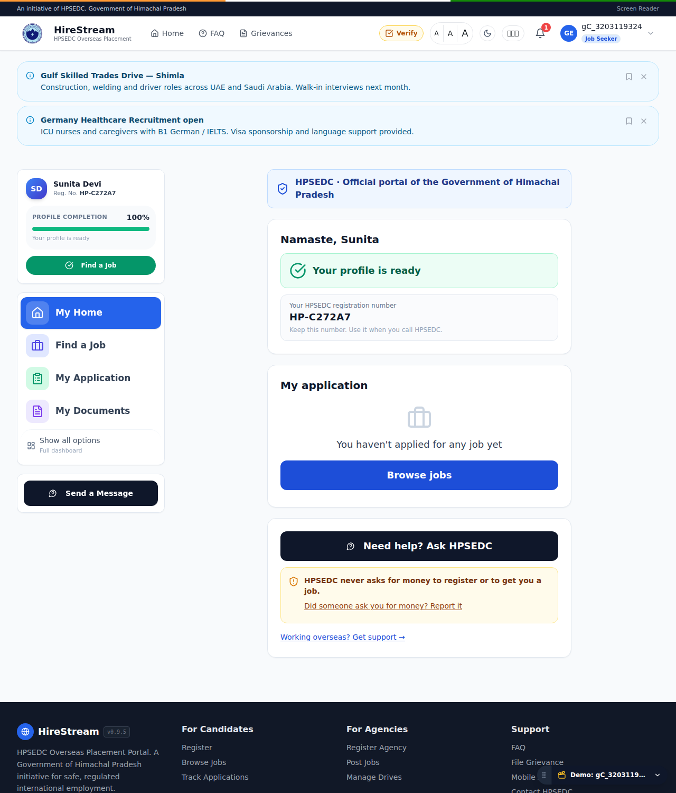

### 2.4 Find a job → apply → track

Each job shows the **typical monthly pay for that category & country** and the **documents that country requires** (with Have-it / Upload / Arrange markers).

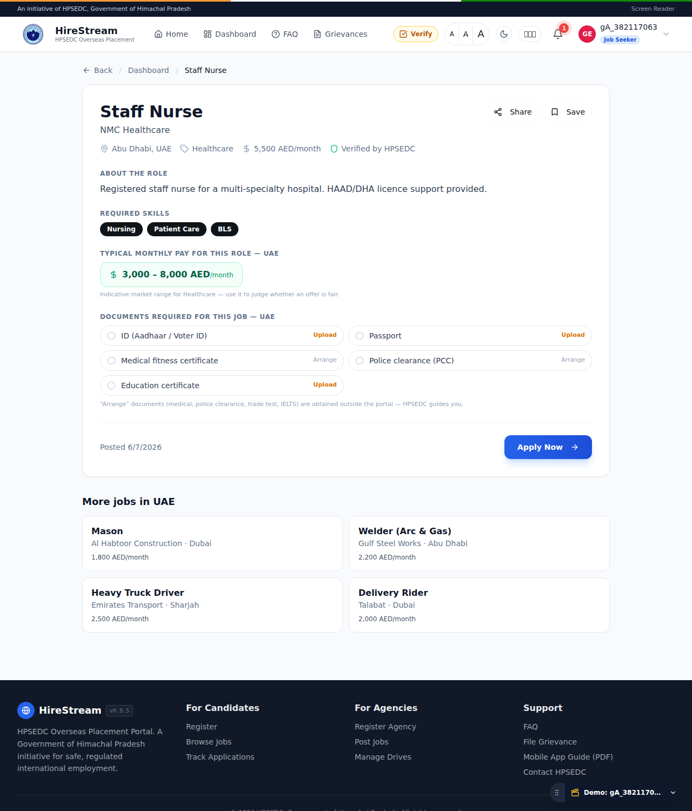

After applying, the applicant tracks progress on **"My Application"** (Applied → Review → Interview → Selected), and gets an offer decision when selected.

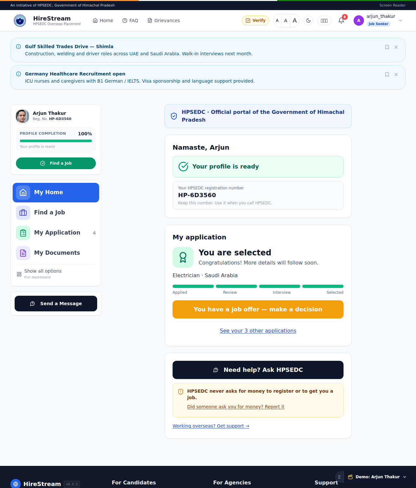

### 2.5 Support after placement

Once placed overseas, the applicant can raise a **support issue** or a monthly **check-in** ("I'm fine" / "I need help"), and reach the official Government-of-India channels (MADAD, eMigrate). HPSEDC works the queue.

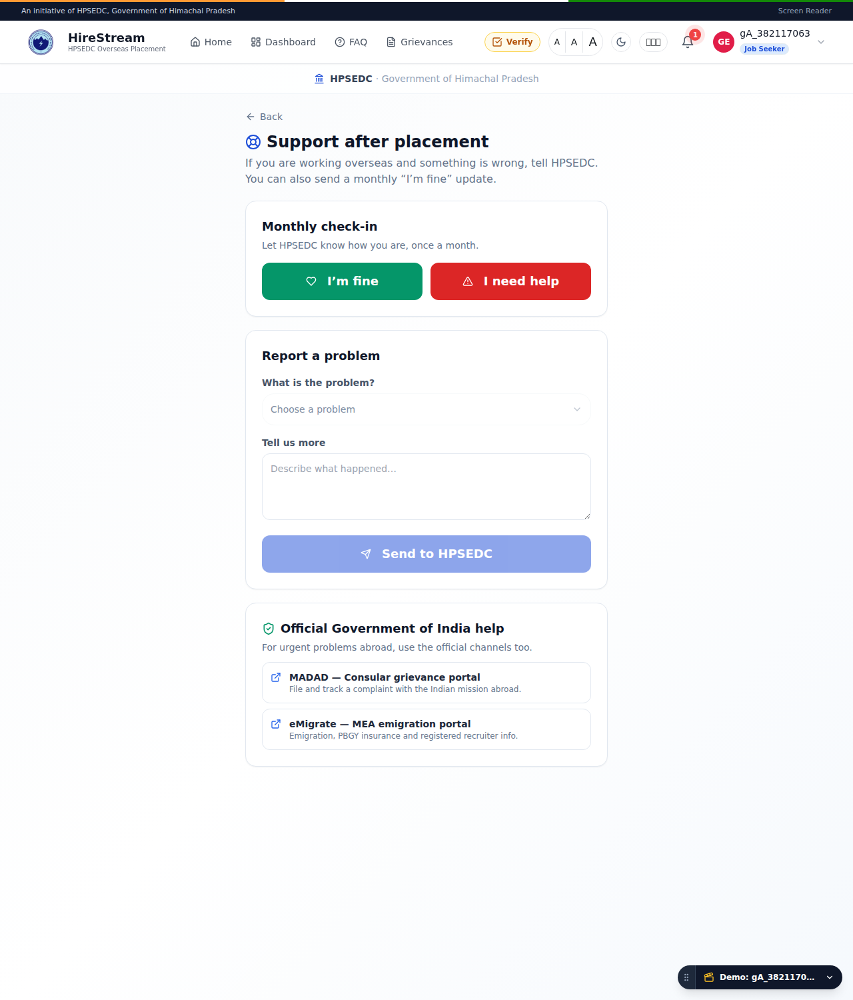

---

## 3. HPSEDC — the single super-agency

Instead of many competing agencies, **HPSEDC is the one super-agency**. All jobs belong to HPSEDC, and HPSEDC manages every candidate and placement. HPSEDC can **post jobs** and run the full recruitment pipeline (largely unchanged from the earlier accepted version).

**Candidate & placement management** (agency view): profile, private notes, **visa/country rejections**, documents, MEA pre-departure compliance (ECR/PCC/medical/PDO/PBBY), and **visa / passport / travel** management.

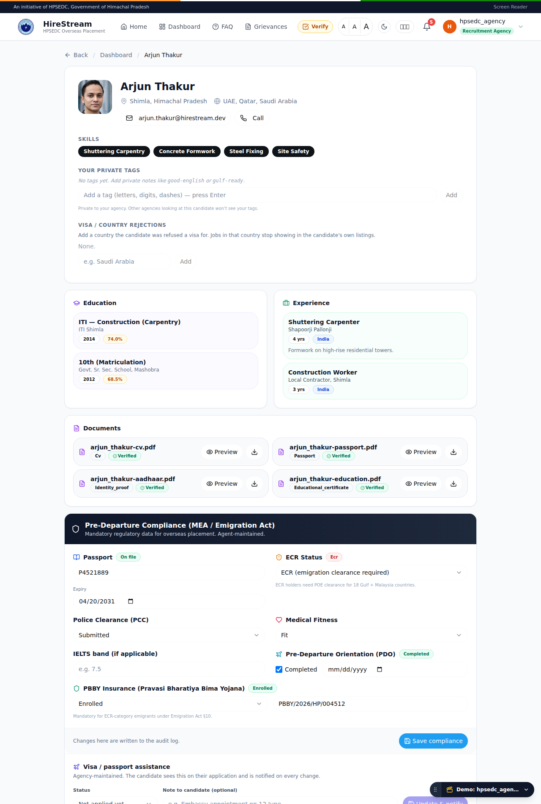

**The pipeline:** `Submitted → Reviewed → Shortlisted → Interview → Selected → Placed`.
- At **Selected**, a placement record is auto-created (visa, travel, welfare).
- The application becomes **Placed** when the candidate **accepts the offer** (or the agency marks it after departure).

---

## 4. Admin

Admin keeps HPSEDC oversight — overview, **Callbacks** (Assisted-tier requests), **Placement Support** queue, **Grievances**, reports and settings.

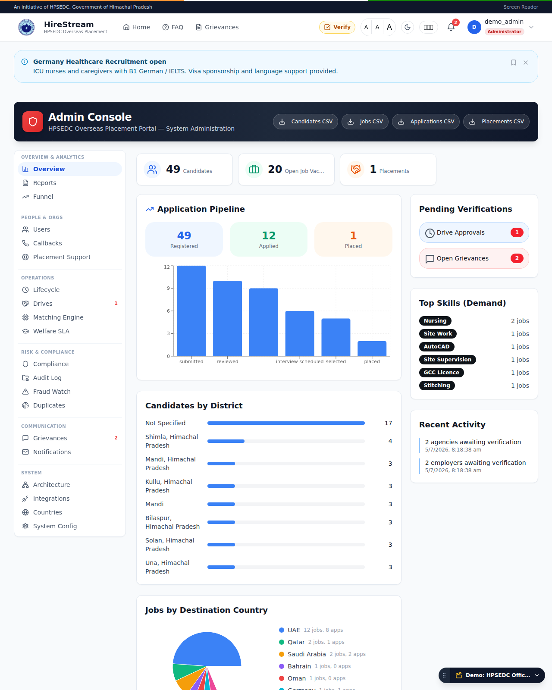

> Some admin features carried over from the multi-agency product are not needed for HPSEDC and can be **hidden in a later pass**.

---

## 5. Test checklist

**Candidate**
- [ ] Register → see the **three registration modes**.
- [ ] Complete **Standard** (blue-collar) — trade → … → review → save.
- [ ] Complete **Professional** (`/apply/pro`) — degree branch.
- [ ] Try **Assisted** — leave name + phone (callback request appears in Admin → Callbacks).
- [ ] Upload **ID + passport** → profile turns **"ready"** with a registration number.
- [ ] Toggle **Minimal ⇄ Advanced** dashboard.
- [ ] Open a job → see **salary band + required documents** → **Apply**.
- [ ] Check **My Application** status.
- [ ] Open **Support** (post-placement) — raise an issue / check-in.
- [ ] Switch **English ⇄ Hindi**.

**HPSEDC Agency** (`hpsedc_agency`)
- [ ] All jobs shown are HPSEDC's; post a new job.
- [ ] Open a candidate → move the application **Submitted → … → Selected → Placed**.
- [ ] Record a **visa / country rejection** → confirm that country's jobs disappear for that candidate.
- [ ] Update **visa status** + **travel date**; verify the candidate is notified.

**Admin** (`demo_admin`)
- [ ] **Callbacks** queue shows Assisted-tier requests.
- [ ] **Placement Support** queue shows candidate issues / check-ins.
- [ ] **Grievances** list.

---

## 6. UAT-03 status

See **`UAT-03_Fix_Report.md`** — **18 of 20 fixed & live**, #18 (fee) out of scope, #20 (WhatsApp) **deferred to Phase 2**.
