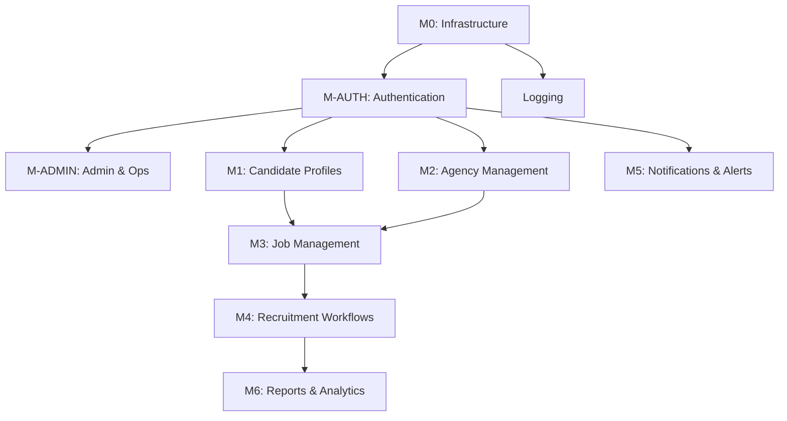

# A3: Module Breakdown — HireStream
> **Template Version:** 2.0 | **Created By:** Agent | **Status:** Final | **Date:** 2026-04-02
> **Depends On:** A1 (Solution Brief), A2 (Solution Architecture)

---

## 1. Module Map

### 1.1 Standard Modules (Every Project)

| # | Module ID | Module Name | Priority | Complexity | Phase | Dependencies |
|---|----------|-------------|----------|-----------|-------|-------------|
| 0 | M0 | Infrastructure & Config | P0 — Must | Low | 1 | None |
| — | M0a | Security Middleware (helmet, rate limit, CORS) | P0 | Low | 1 | M0 |
| — | M0b | Error Handling (centralized handler) | P0 | Low | 1 | M0 |
| — | M0c | Logging Setup (structured JSON, log levels) | P0 | Low | 1 | M0 |
| — | M0d | Health Check Endpoints | P0 | Low | 1 | M0 |
| 1 | M-AUTH | Authentication & RBAC | P0 — Must | Medium | 1 | M0 |
| 2 | M-ADMIN | Admin & Operations Module | P0 — Must | Medium | 1 | M-AUTH |
| — | M-ADMIN.1 | Config Management (UI + API) | P0 | Medium | 1 | M-AUTH |
| — | M-ADMIN.2 | Log Viewer (App + Server logs) | P0 | Medium | 1 | M-AUTH, M0c |
| — | M-ADMIN.3 | Health Dashboard | P0 | Low | 1 | M0d |

### 1.2 Project-Specific Modules

| # | Module ID | Module Name | Priority | Complexity | Phase | Dependencies |
|---|----------|-------------|----------|-----------|-------|-------------|
| 3 | M1 | Candidate Profiles & Reg | P0 — Must | Medium | 2 | M-AUTH |
| 4 | M2 | Agency Management | P0 — Must | Medium | 2 | M-AUTH |
| 5 | M3 | Job Management (Posting/Search) | P0 — Must | High | 2 | M1, M2 |
| 6 | M4 | Recruitment Workflows | P0 — Must | High | 3 | M1, M2, M3 |
| 7 | M5 | Notifications & Alerts | P1 — Should | Medium | 3 | M-AUTH |
| 8 | M6 | Reports & Analytics | P1 — Should | Medium | 4 | All |

---

## 2. Dependency Graph

---

## 3. Module Detail Template

### M1: Candidate Profiles & Reg

| Field | Value |
|-------|-------|
| **Priority** | P0 |
| **Phase** | 2 |
| **Complexity** | Medium |
| **Estimated Effort** | 3 days |
| **Dependencies** | M-AUTH |
| **FRS Reference** | §2.3 — Candidate Registration Workflow |

#### Database Tables
| Table | Purpose | Key Columns |
|-------|---------|-------------|
| `candidates` | Storing candidate profiles | `user_id`, `skills`, `education`, `experience` |
| `documents` | User uploaded docs (Certificates, Passports) | `user_id`, `doc_type`, `url` |

#### API Endpoints
| Method | Endpoint | Purpose | Auth | Roles |
|--------|----------|---------|------|-------|
| GET | `/api/v1/candidates/profile` | Get logged-in candidate profile | Yes | candidate |
| PATCH | `/api/v1/candidates/profile` | Update profile information | Yes | candidate |
| POST | `/api/v1/candidates/documents` | Upload a document | Yes | candidate |

#### UI Components
| Component | Type | Route | Description |
|-----------|------|-------|------------|
| `CandidateProfile` | Page | `/candidate/profile` | Renders candidate details form |
| `DocumentUpload` | Modal | `/candidate/documents` | Handles file upload (up to 5MB, PDF/JPG) |

### M2: Agency Management

| Field | Value |
|-------|-------|
| **Priority** | P0 |
| **Phase** | 2 |
| **Complexity** | Medium |
| **Estimated Effort** | 2 days |
| **Dependencies** | M-AUTH |
| **FRS Reference** | §2.5 — Recruiting Agency Registration |

#### Database Tables
| Table | Purpose | Key Columns |
|-------|---------|-------------|
| `agencies` | Stores company and license info | `user_id`, `license_no`, `status` |

#### API Endpoints
| Method | Endpoint | Purpose | Auth | Roles |
|--------|----------|---------|------|-------|
| POST | `/api/v1/agencies/register` | Submit agency license for approval | Yes | agent |
| PATCH | `/api/v1/admin/agencies/:id` | Approve/Reject agency | Yes | admin |

#### UI Components
| Component | Type | Route | Description |
|-----------|------|-------|------------|
| `AgencyRegistrationForm` | Form | `/agent/register` | Form for license verification |
| `AdminAgencyReview` | Page | `/admin/agencies` | HPSEDC Admin panel to approve/reject agencies |

### M3: Job Management (Posting/Search)

| Field | Value |
|-------|-------|
| **Priority** | P0 |
| **Phase** | 2 |
| **Complexity** | High |
| **Estimated Effort** | 4 days |
| **Dependencies** | M1, M2 |
| **FRS Reference** | §2.4, 2.5 — Job Posting and Searching workflows |

#### Database Tables
| Table | Purpose | Key Columns |
|-------|---------|-------------|
| `jobs` | Job listings | `agency_id`, `title`, `description`, `location`, `salary` |

#### API Endpoints
| Method | Endpoint | Purpose | Auth | Roles |
|--------|----------|---------|------|-------|
| POST | `/api/v1/jobs` | Post a new job | Yes | agent (approved) |
| GET | `/api/v1/jobs` | Search available jobs via filters | Yes | candidate |

#### UI Components
| Component | Type | Route | Description |
|-----------|------|-------|------------|
| `JobPoster` | Form | `/agent/jobs/new` | Multi-step form for creating a job listing |
| `JobSearchBoard` | Page | `/candidate/jobs` | Advanced filter & search interface for jobs |

---

## 4. Cross-Module Concerns

| Concern | Approach | Implemented In |
|---------|---------|---------------|
| **Error Handling** | Centralized error middleware | M0 |
| **Authorization** | RBAC middleware `req.user.role` | M-AUTH |
| **Logging** | Structured file logs via Winston | M0, M-ADMIN |

---

## 5. Effort Summary

| Phase | Modules | Total Effort (days) | Estimated Duration |
|-------|---------|--------------------|--------------------|
| 1 | M0, M-AUTH, M-ADMIN | DONE | Sprint 1 |
| 2 | M1, M2, M3 | 9 days | Sprint 2 |
| 3 | M4, M5 | 10 days | Sprint 3 |
| 4 | M6 | 4 days | Sprint 4 |
| **Total** | **8 modules** | **23 days** | **4 sprints** |

---

## 6. Module Status Tracker

| Module | Backend | Frontend | Tests | Integration | Status |
|--------|---------|----------|-------|-------------|--------|
| M0 Infrastructure | ✅ | ✅ | ✅ | ✅ | Complete |
| M-AUTH | ✅ | ✅ | ✅ | ✅ | Complete |
| M-ADMIN | ✅ | ✅ | ✅ | ✅ | Complete |
| M1 Candidate Profiles | ☐ | ☐ | ☐ | ☐ | Not Started |
| M2 Agency Mgmt | ☐ | ☐ | ☐ | ☐ | Not Started |
| M3 Job Management | ☐ | ☐ | ☐ | ☐ | Not Started |
| M4 Recruitment | ☐ | ☐ | ☐ | ☐ | Not Started |
| M5 Notifications | ☐ | ☐ | ☐ | ☐ | Not Started |
| M6 Reporting | ☐ | ☐ | ☐ | ☐ | Not Started |

---

## 7. Revision History

| Version | Date | Author | Changes |
|---------|------|--------|---------|
| 1.0 | 2026-04-02 | Agent | Initial creation extracted from FRS.txt |
