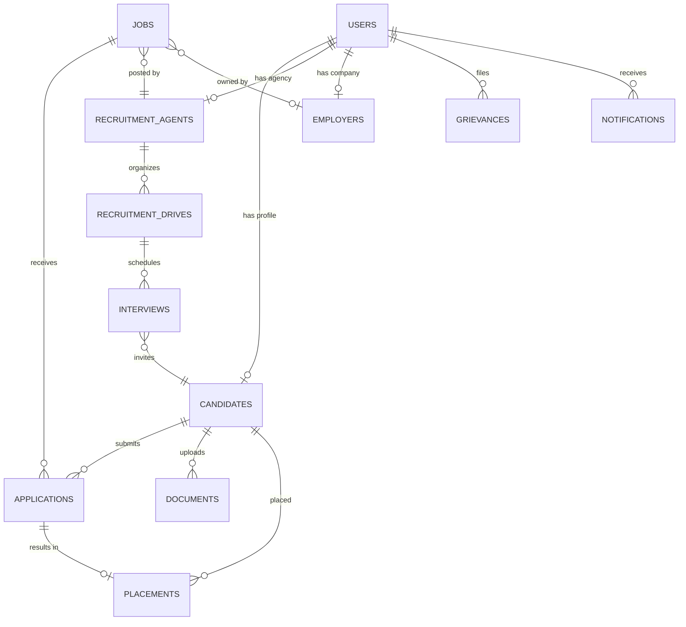

# HireStream — System Architecture Document
**Project:** Overseas Placement Portal (HPSEDC)
**Version:** 1.1 | **Date:** 2026-03-26
**Status:** Approved for Development

---

## 1. Document Purpose

This document defines the **target system architecture** for HireStream, derived directly from the Functional Requirements Specification (FRS) for the Overseas Placement Portal. It serves as the single source of truth for all technical decisions, component boundaries, data flows, and integration contracts throughout the development lifecycle.

---

## 2. Architecture Overview

HireStream follows a **Monolithic Full-Stack** architecture with a clear separation between client, server, and shared layers. The system is deployed as a single Node.js process serving both the API and the SPA, fronted by Nginx as a reverse proxy.

```
┌─────────────────────────────────────────────────────────────────────┐
│                        NGINX REVERSE PROXY                         │
│                  (SSL Termination, Static Cache)                   │
└────────────────────────────┬────────────────────────────────────────┘
                             │
                             ▼
┌─────────────────────────────────────────────────────────────────────┐
│                     NODE.JS APPLICATION (PM2)                      │
│  ┌─────────────────────────┐   ┌─────────────────────────────────┐ │
│  │     EXPRESS.JS API      │   │      VITE (Dev) / Static        │ │
│  │  /api/* endpoints       │   │   React SPA (Production)        │ │
│  │  Middleware Pipeline    │   │   client/dist/public             │ │
│  └────────────┬────────────┘   └─────────────────────────────────┘ │
│               │                                                     │
│  ┌────────────▼────────────────────────────────────────────────────┐│
│  │                   SHARED LAYER (@shared/)                      ││
│  │           Drizzle Schemas · Zod Validators · Types             ││
│  └────────────┬───────────────────────────────────────────────────┘│
└───────────────┼─────────────────────────────────────────────────────┘
                │
     ┌──────────┼──────────┐
     ▼          ▼          ▼
┌─────────┐ ┌────────┐ ┌───────────┐
│PostgreSQL│ │MinIO/S3│ │Redis      │
│(Neon DB) │ │(Files) │ │(Sessions) │
└─────────┘ └────────┘ └───────────┘
```

---

## 3. Technology Stack (Locked)

| Layer | Technology | Version | Rationale |
|:---|:---|:---|:---|
| **Frontend** | React + TypeScript | 18.x / 5.6 | Already implemented; mature ecosystem |
| **UI Kit** | shadcn/ui + Radix | Latest | Already integrated; accessible components |
| **Styling** | Tailwind CSS | 3.4 | Already configured; utility-first |
| **Animations** | Framer Motion | 11.x | Already installed |
| **Routing (Client)** | Wouter | 3.x | Lightweight; already in use |
| **State/Fetching** | TanStack Query | 5.x | Already configured with QueryClient |
| **Forms** | React Hook Form + Zod | 7.x / 3.x | Already installed |
| **Backend** | Express.js | 4.x | Already scaffolded |
| **ORM** | Drizzle ORM | 0.39 | Schema already defined |
| **Database** | PostgreSQL (Neon) | 16 | Serverless; schema ready |
| **Auth** | Passport.js (local + custom SSO) | 0.7 | Already in dependencies |
| **Sessions** | express-session + connect-pg-simple | — | Already in dependencies |
| **Build/Dev** | Vite + esbuild | 5.4 / 0.25 | Already configured |
| **Process Manager** | PM2 | Latest | Standard for Node.js on VM |

### New Packages Required

| Package | Purpose | Phase |
|:---|:---|:---|
| `bcrypt` | Password hashing | Phase 1 |
| `helmet` | Security headers | Phase 1 |
| `express-rate-limit` | Rate limiting | Phase 1 |
| `multer` | File uploads | Phase 2 |
| `nodemailer` | Email notifications | Phase 2 |
| `winston` / `pino` | Structured logging | Phase 1 |
| `react-i18next` + `i18next` | Internationalization (EN/HI) | Phase 3 |
| `@sentry/node` | Error tracking (optional) | Phase 4 |
| `jest` + `@testing-library/react` | Testing | Phase 4 |
| `vite-plugin-pwa` | Progressive Web App manifest + service worker | Phase 2 |
| `pdf-lib` or `puppeteer` | PDF profile generation for agency downloads | Phase 2 |
| `axe-core` | Accessibility audit scoring (GIGW) | Phase 4 |

---

## 4. Directory Structure (Target)

```
HireStream/
├── client/                      # Frontend SPA
│   ├── src/
│   │   ├── components/
│   │   │   ├── ui/              # shadcn primitives (existing)
│   │   │   ├── candidate/       # Candidate-specific (existing)
│   │   │   ├── agent/           # Agent-specific (existing)
│   │   │   ├── employer/        # Employer-specific (existing)
│   │   │   ├── admin/           # Admin-specific (existing)
│   │   │   ├── layout/          # Header, Footer, Sidebar (existing)
│   │   │   └── shared/          # NEW: Reusable cross-role components
│   │   ├── hooks/               # Custom React hooks (existing)
│   │   ├── lib/                 # Utilities, queryClient (existing)
│   │   ├── locales/             # NEW: i18n translation JSONs (en/, hi/)
│   │   ├── pages/               # Page-level components (existing)
│   │   ├── contexts/            # NEW: Auth, Theme, Language contexts
│   │   ├── App.tsx
│   │   ├── main.tsx
│   │   └── index.css
│   └── index.html
│
├── server/                      # Backend API
│   ├── index.ts                 # Express app bootstrap (existing)
│   ├── routes.ts                # Route registration (existing, empty)
│   ├── storage.ts               # Storage interface (existing)
│   ├── vite.ts                  # Vite dev middleware (existing)
│   ├── routes/                  # NEW: Modular route files
│   │   ├── auth.routes.ts
│   │   ├── candidate.routes.ts
│   │   ├── job.routes.ts
│   │   ├── application.routes.ts
│   │   ├── agency.routes.ts
│   │   ├── admin.routes.ts
│   │   ├── upload.routes.ts
│   │   └── grievance.routes.ts
│   ├── middleware/               # NEW: Express middleware
│   │   ├── auth.middleware.ts
│   │   ├── rbac.middleware.ts
│   │   ├── validate.middleware.ts
│   │   ├── rateLimit.middleware.ts
│   │   └── errorHandler.middleware.ts
│   ├── services/                 # NEW: Business logic
│   │   ├── auth.service.ts
│   │   ├── candidate.service.ts
│   │   ├── job.service.ts
│   │   ├── application.service.ts
│   │   ├── matching.service.ts
│   │   ├── notification.service.ts
│   │   ├── upload.service.ts
│   │   └── report.service.ts
│   └── config/                   # NEW: App configuration
│       ├── passport.config.ts
│       ├── logger.config.ts
│       └── env.config.ts
│
├── shared/                       # Shared between client & server
│   ├── schema.ts                 # Drizzle table definitions (existing)
│   ├── validators.ts             # NEW: Zod validation schemas
│   ├── types.ts                  # NEW: Shared TypeScript types
│   └── constants.ts              # NEW: Enums, status codes, config
│
├── migrations/                   # NEW: Drizzle migration output
├── uploads/                      # NEW: Local file storage (dev)
├── tests/                        # NEW: Test suites
│   ├── unit/
│   ├── integration/
│   └── e2e/
│
├── drizzle.config.ts             # Drizzle Kit config (existing)
├── vite.config.ts                # Vite config (existing)
├── tailwind.config.ts            # Tailwind config (existing)
├── tsconfig.json                 # TypeScript config (existing)
├── package.json                  # Dependencies (existing)
├── .env                          # Environment variables (existing)
└── A.PMD/                        # Project Management Directory
```

---

## 5. Data Architecture

### 5.1 Entity Relationship Diagram



### 5.2 Database Schema Extensions (New Tables Required by FRS)

The existing schema covers `users`, `candidates`, `jobs`, `applications`, `recruitmentAgents`, and `employers`. The following **new tables** must be added to satisfy the FRS:

| New Table | Purpose (FRS Reference) |
|:---|:---|
| `documents` | CV, passport, certificate uploads linked to candidates (§2.3) |
| `candidate_education` | Structured education records: degree, institution, year, grade (§2.2) |
| `candidate_experience` | Structured work history: company, role, from/to dates (§2.2) |
| `application_documents` | Per-application tailored document attachments (§2.4) |
| `recruitment_drives` | Scheduled drives by agencies with date/time/location (§2.5, §2.7) |
| `interviews` | Interview scheduling per candidate per drive (§2.7) |
| `placements` | Post-selection records: appointment letters, visa status (§2.7) |
| `grievances` | Grievance tickets filed by any user role (§2.8) |
| `notifications` | Email/SMS/in-app notification log (§2.2) |
| `audit_log` | Admin activity tracking for compliance (§2.6) |
| `faq_content` | FAQ entries managed by admin (§2.8) |
| `training_events` | Admin-created training sessions with candidate registration (§2.1) |
| `announcements` | Portal-wide banners/announcements managed by admin (§1.2) |

### 5.3 Schema Modification — `users` Table Extension

The current `users` table lacks fields required by the FRS:

```typescript
// Fields to ADD to the existing users table
aadhaarNumber: text("aadhaar_number"),         // Aadhaar verification (§1.2)
aadhaarVerified: boolean("aadhaar_verified"),   // Verification status
phoneNumber: text("phone_number"),              // SMS OTP auth (§2.2)
phoneVerified: boolean("phone_verified"),       // Phone verification status
himAccessId: text("him_access_id"),             // HIM Access SSO ID (§2.2)
preferredLanguage: text("preferred_language").default("en"), // i18n (§1.2)
isActive: boolean("is_active").default(true),   // Account status
lastLoginAt: timestamp("last_login_at"),        // Audit
```

### 5.4 Schema Modification — `jobs` Table Extension

```typescript
// Field to ADD to the existing jobs table
sector: text("sector"),                            // Industry sector filter (§2.4)
```

### 5.5 Schema Modification — `recruitment_agents` Table Extension

```typescript
// Fields to ADD
pastRecord: text("past_record"),                   // Textual past record (§2.2)
references: jsonb("references"),                    // Reference contacts (§2.2)
```

### 5.6 New Structured Data Tables

```typescript
// candidate_education — structured education records (§2.2)
id, candidateId, degree, institution, year, grade, fieldOfStudy

// candidate_experience — structured work history (§2.2)
id, candidateId, company, role, fromDate, toDate, description, country

// application_documents — per-application doc attachments (§2.4)
id, applicationId, fileName, fileUrl, type, uploadedAt
```

---

## 6. API Architecture

### 6.1 API Design Principles

- **RESTful** with `/api` prefix for all endpoints
- **Versioned**: `/api/v1/*` (future-proofing)
- **JSON** request/response bodies
- **Zod** validation on all inputs via middleware
- **Consistent error format**: `{ success: false, error: { code, message, details } }`
- **Pagination**: `?page=1&limit=20` with response metadata

### 6.2 API Endpoint Map

#### Authentication (§2.2, §2.3)
| Method | Endpoint | Description |
|:---|:---|:---|
| POST | `/api/v1/auth/register` | Register with email/phone |
| POST | `/api/v1/auth/login` | Login with credentials |
| POST | `/api/v1/auth/logout` | Destroy session |
| POST | `/api/v1/auth/verify-otp` | OTP verification |
| GET  | `/api/v1/auth/me` | Current user profile |
| POST | `/api/v1/auth/him-access/callback` | HIM Access SSO callback |

#### Candidates (§2.2, §2.3)
| Method | Endpoint | Description |
|:---|:---|:---|
| GET | `/api/v1/candidates/:id` | Get candidate profile |
| PATCH | `/api/v1/candidates/:id` | Update profile |
| POST | `/api/v1/candidates/:id/documents` | Upload documents |
| GET | `/api/v1/candidates/:id/applications` | List applications |

#### Jobs (§2.4)
| Method | Endpoint | Description |
|:---|:---|:---|
| GET | `/api/v1/jobs` | Search/filter jobs |
| GET | `/api/v1/jobs/:id` | Job detail |
| POST | `/api/v1/jobs` | Create job (agent/employer) |
| PATCH | `/api/v1/jobs/:id` | Update job |
| DELETE | `/api/v1/jobs/:id` | Close/remove job |

#### Applications (§2.4, §2.7)
| Method | Endpoint | Description |
|:---|:---|:---|
| POST | `/api/v1/applications` | Apply to job |
| GET | `/api/v1/applications/:id` | Application status |
| PATCH | `/api/v1/applications/:id/status` | Update status (shortlist, reject) |

#### Agencies (§2.5, §2.6)
| Method | Endpoint | Description |
|:---|:---|:---|
| POST | `/api/v1/agencies/register` | Agency registration |
| GET | `/api/v1/agencies` | List agencies |
| PATCH | `/api/v1/agencies/:id/verify` | Admin approve/reject |

#### Recruitment Drives & Interviews (§2.7)
| Method | Endpoint | Description |
|:---|:---|:---|
| POST | `/api/v1/drives` | Schedule drive |
| GET | `/api/v1/drives` | List drives |
| POST | `/api/v1/drives/:id/interviews` | Schedule interviews |
| PATCH | `/api/v1/interviews/:id/result` | Record result |

#### Admin (§2.6)
| Method | Endpoint | Description |
|:---|:---|:---|
| GET | `/api/v1/admin/dashboard` | Aggregated stats |
| GET | `/api/v1/admin/reports` | Generate reports |
| GET | `/api/v1/admin/grievances` | Manage grievances |
| GET | `/api/v1/admin/audit-log` | Activity audit trail |

#### FAQ & Content (§2.8, §1.2)
| Method | Endpoint | Description |
|:---|:---|:---|
| GET | `/api/v1/faq` | Public FAQ listing |
| POST | `/api/v1/admin/faq` | Create FAQ entry (admin) |
| PATCH | `/api/v1/admin/faq/:id` | Update FAQ entry |
| DELETE | `/api/v1/admin/faq/:id` | Remove FAQ entry |
| GET | `/api/v1/announcements` | Active announcements |
| POST | `/api/v1/admin/announcements` | Create announcement (admin) |

#### Training Events (§2.1)
| Method | Endpoint | Description |
|:---|:---|:---|
| GET | `/api/v1/training-events` | List upcoming training events |
| POST | `/api/v1/admin/training-events` | Create training event (admin) |
| POST | `/api/v1/training-events/:id/register` | Candidate registers interest |

#### Profile Export (§2.2 — Agency download profiles)
| Method | Endpoint | Description |
|:---|:---|:---|
| GET | `/api/v1/candidates/:id/pdf` | Generate formatted PDF profile |
| GET | `/api/v1/jobs/:id/applicants/export` | Bulk CSV/ZIP download of applicants |

#### Drive Approvals (§2.6)
| Method | Endpoint | Description |
|:---|:---|:---|
| PATCH | `/api/v1/admin/drives/:id/approve` | Approve/reject recruitment drive |

#### System Health
| Method | Endpoint | Description |
|:---|:---|:---|
| GET | `/api/v1/admin/health` | System + backup health check |

---

## 7. Authentication & Authorization Architecture

### 7.1 Auth Flow

```
┌──────────┐     ┌──────────────┐     ┌───────────────┐
│  Client   │────▶│  Express API │────▶│  Passport.js  │
│  (React)  │◀────│  /api/auth/* │◀────│  Strategies   │
└──────────┘     └──────┬───────┘     └───────┬───────┘
                        │                     │
                        ▼                     ▼
                 ┌─────────────┐      ┌──────────────┐
                 │  Session    │      │  PostgreSQL   │
                 │  (pg-simple)│      │  users table  │
                 └─────────────┘      └──────────────┘
```

### 7.2 Authentication Methods (as per FRS §2.2)

1. **Email + Password** — Standard registration with bcrypt hashing
2. **Phone + OTP** — SMS-based OTP via Government SMS Gateway
3. **Aadhaar Verification** — UIDAI API integration for identity confirmation
4. **HIM Access SSO** — OAuth2/SAML callback integration for HP state login

### 7.3 Role-Based Access Control (RBAC)

| Role | Access Scope |
|:---|:---|
| `candidate` | Own profile, job search, applications, documents, grievances |
| `agent` | Agency profile, job postings, candidate management, drives, interviews |
| `employer` | Company profile, job postings, application reviews |
| `admin` | Full system: approvals, reports, grievances, audit, user management |

RBAC is enforced by `rbac.middleware.ts` which checks `req.user.role` against allowed roles per route.

---

## 8. External Integrations

| Integration | Protocol | Purpose (FRS Ref) | Phase |
|:---|:---|:---|:---|
| **HIM Access SSO** | OAuth2 / SAML | State government single sign-on (§2.2) | Phase 1 |
| **UIDAI Aadhaar** | REST API | Identity verification (§2.3) | Phase 1 |
| **DigiLocker** | REST API | Verified document retrieval (§2.8) | Phase 2 |
| **NIC/CDAC SMS Gateway** | HTTP API | OTP & notification SMS (§2.2) | Phase 2 |
| **SMTP (Gov Mail)** | SMTP / API | Email notifications (§2.2) | Phase 2 |

---

## 9. Security Architecture (FRS §2.9, §3.2)

| Requirement | Implementation |
|:---|:---|
| **HTTPS/TLS** | Nginx SSL termination with Let's Encrypt |
| **Data Encryption** | bcrypt for passwords; TLS in transit; PG encryption at rest |
| **Input Validation** | Zod schemas on every API endpoint |
| **Rate Limiting** | `express-rate-limit`: 100 req/15min per IP for auth routes |
| **Security Headers** | `helmet` middleware (CSP, X-Frame, HSTS) |
| **CORS** | Whitelist origin domains only |
| **SQL Injection** | Parameterized queries via Drizzle ORM |
| **XSS Protection** | React DOM auto-escaping + helmet CSP |
| **RBAC** | Middleware-enforced role checks |
| **Audit Logging** | All admin actions logged to `audit_log` table |
| **GIGW Compliance** | Accessibility features, bilingual interface, skip-to-content, sitemap, ≥4.5:1 contrast |
| **ISO 27001** | Vulnerability scans, access controls, data classification |

---

## 10. Non-Functional Requirements (FRS §3.2)

| NFR | Target | Architecture Decision |
|:---|:---|:---|
| **Page Load** | < 3 seconds | Vite code-splitting, lazy routes, CDN static assets |
| **Concurrent Users** | 5,000 | Nginx load balancing, PM2 cluster mode, connection pooling |
| **Uptime** | 99.9% | PM2 auto-restart, health checks, DB failover (Neon) |
| **API Response** | < 500ms (p95) | Indexed DB queries, Redis caching for hot data |
| **Mobile Responsive** | Full support | Tailwind responsive utilities (already implemented) |
| **Accessibility** | Screen reader support | Radix UI aria attributes, semantic HTML |
| **Scalability** | Horizontal | Stateless API (sessions in PG), PM2 cluster, Neon auto-scaling |
| **Data Backup** | Every 6 hours | Neon automated snapshots + pg_dump cron |

---

## 11. Deployment Architecture

```
                          ┌──────────────────┐
                          │   DNS (Cloudflare)│
                          └────────┬─────────┘
                                   │
                          ┌────────▼─────────┐
                          │   Nginx           │
                          │   - SSL (LE)      │
                          │   - Static cache  │
                          │   - Proxy /api    │
                          └────────┬─────────┘
                                   │
                 ┌─────────────────┼─────────────────┐
                 │                 │                   │
         ┌───────▼──────┐ ┌───────▼──────┐   ┌───────▼──────┐
         │  PM2 Worker 1│ │  PM2 Worker 2│   │  PM2 Worker N│
         │  (Node.js)   │ │  (Node.js)   │   │  (Node.js)   │
         └───────┬──────┘ └───────┬──────┘   └───────┬──────┘
                 │                 │                   │
         ┌───────▼─────────────────▼───────────────────▼──────┐
         │                   PostgreSQL (Neon)                  │
         └─────────────────────────────────────────────────────┘
```

---

## 12. Architecture Decision Records (ADR)

### ADR-001: PWA Instead of Native iOS/Android Apps

| Field | Value |
|:---|:---|
| **Date** | 2026-03-26 |
| **Status** | Accepted |
| **FRS Reference** | §2.8 — "iOS and Android applications" |
| **Decision** | Build a Progressive Web App (PWA) to satisfy the mobile requirement. **No native iOS or Android apps will be developed in Phase 1–5.** |
| **Rationale** | A PWA delivers installable, offline-capable, push-notification-enabled mobile experience using the existing React + Vite stack. This avoids the cost and complexity of maintaining separate native codebases (Swift/Kotlin), separate app store submissions, and separate CI/CD pipelines. The FRS requirement for "iOS and Android applications" is met via the browser-based install capability. |
| **Consequences** | The app will be installable via Chrome/Safari "Add to Home Screen." Push notifications will use the Web Push API. Offline mode will cache static pages via a service worker. If HPSEDC later requires a store-listed native app, the PWA can be wrapped using Capacitor or TWA (Trusted Web Activity) with minimal effort. |
| **Revisit Trigger** | If HPSEDC explicitly mandates App Store / Play Store listing, evaluate Capacitor wrapper at that time. |

---

## 13. Revision History

| Version | Date | Author | Changes |
|:---|:---|:---|:---|
| 1.0 | 2026-03-26 | HireStream Dev Team | Initial architecture derived from FRS |
| 1.1 | 2026-03-26 | HireStream Dev Team | FRS cross-check: +6 tables, +15 endpoints, PWA, GIGW, exceed-expectations enhancements |
| 1.2 | 2026-03-26 | HireStream Dev Team | Added ADR-001: PWA over native apps decision record |

